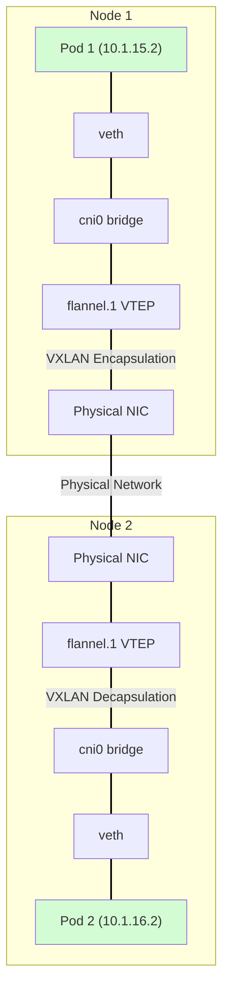

## list and watch
### informer
Informer是Kubernetes的一个机制，用于监听和缓存Kubernetes API服务器中的资源对象变化。它通过watch机制实时获取资源对象的变化，并将其缓存到本地内存中，以提高访问速度和减少API服务器的负载。

### lister
Lister是Kubernetes的一个机制，用于从缓存中获取资源对象。它提供了一种高效的方式来列出和获取特定资源类型的对象，而无需直接访问API服务器。Lister通常与Informer配合使用，以提高性能和减少API调用。

### service 
service 提供稳定的ip地址和dns以及负载均衡。但是其实际上是依赖于kube-proxy的。

**pod之间通信过程举例**
1. pod中的进程首先在开发时约定了service的名称或者是环境变量中约定或者在configmap中约定。因此得到URL。
2. 进程发起请求之后会由系统进行DNS解析，得到service的clusterIP地址。
3. 内核会查询路由表，发现需要走默认网关。
4. kube-proxy会创建iptables规则拦截数据包。
5. iptables规则会将目标地址转换为实际的pod IP地址。
6. 内核会将数据包路由到实际的pod。

**service 与 endpoint 之间的关系**
Endpoint controller通过api servser的的watch机制来实时感知pod的变化。如果出现了变化，Endpoint controller会获取pod列表，筛选出属于该service的pod，提取出pod的ip地址和端口，将这些信息存储到Endpoint对象中。

**service 与 kube-proxy 之间的关系**
Service 提供稳定的虚拟 IP 和服务发现，kube-proxy 负责将这个虚拟 IP 的流量实际转发到后端 Pod，两者配合实现了 Kubernetes 的服务网络。

**dns 解析过程**
k8s会提供一个dns解析服务，并在pod文件系统中的配置文件（操作系统读取 /etc/resolv.conf）中指定dns解析服务的地址，然后由操作系统将dns解析的请求发送往dns解析服务。所以在应用开发的时候就需要使用url的形式来访问服务，而不是直接使用ip地址，并读取环境变量或者配置文件中的服务地址。

在每一个node上都会有一个CoreDNS作为DaemonSet运行，接收来自pod的DNS解析请求。

#### 负载均衡机制实现原理
1. **iptables**
2. **ipvs**。service上分配的clusterIP实际上会新建一个虚拟网口，并将service的clusterIP和端口绑定到这个虚拟网口上。容器或者节点上进程访问地址的时候，会进入到ipvs的input hook点，然后进行负载均衡。
3. **eBPF**。

### CRD (Custom Resource Definition)
见 [k8s官方文档](https://kubernetes.io/zh-cn/docs/concepts/extend-kubernetes/api-extension/custom-resources/)

CRD是Kubernetes的扩展机制，允许用户定义自己的资源类型。同样通过yaml文件进行定义和创建，通过kubectl命令进行管理。
两部分组成：**CRD定义**和**CR实例**。
CRD定义了资源的名称、版本、规范等信息，而CR实例则是该资源类型的具体实例。还需要一个**Controller**来管理CR实例的生命周期。

## 网络

在了解Kubernetes网络之前，先了解docker的网络结构，这是一种在单节点上的网络结构。
而Kubernetes的网络结构是多节点的网络结构，需要通过软件构建一个可以把所有容器连接起来的虚拟网络，这种技术被称为**覆盖网络**（Overlay Network）。

### Flannel

容器网络方案，支持三种后端实现
1. VXLAN
2. host-gw
3. UDP (已废弃)

#### UDP

创建一个TUN设备(关于TUN设备的性质，TUN是用于用户态和内核态之间的L3层设备)从bridge中接收数据包，然后通过UDP协议封装，目的地址和源地址分别是目标节点和源节点的IP地址，然后通过物理网络发送出去。会发送给目的节点的flanneld进程，flanneld进程会将数据包解封装，然后送入bridge，最终送到目标容器。

缺点：效率低，发送阶段需要三次切换内核态和用户态，接收阶段也需要三次切换内核态和用户态。

#### VXLAN(virtual extensible LAN)

目前主流的实现方式。
在三层网络上构建一个虚拟的二层网络。通过在二层数据包外面封装一层UDP头，实现二层数据包在三层网络上的传输。
**VTEP**：VXLAN Tunnel Endpoint，VXLAN隧道端点。负责将二层数据包封装成VXLAN包，或者将VXLAN包解封装成二层数据包。

下面是 Flannel VXLAN 模式的通信流程图：

**流程说明:**

1.  **源 Pod (Node 1)**: `Pod 1` 发送数据包，通过 `veth` 对到达宿主机上的 `cni0` 网桥。
2.  **cni0 网桥 (Node 1)**: `cni0` 网桥根据路由规则，将数据包转发给 `flannel.1` 设备。
3.  **VXLAN 封装 (Node 1)**: `flannel.1` (VTEP) 将原始数据包封装成一个 VXLAN 包（即在外部添加 VXLAN 头、UDP 头和 IP 头）。外部 IP 包的源地址是 `Node 1` 的物理 IP，目标地址是 `Node 2` 的物理 IP。
4.  **物理网络传输**: 封装后的数据包通过 `Node 1` 的物理网卡发送到 `Node 2`。
5.  **VXLAN 解封装 (Node 2)**: `Node 2` 的 `flannel.1` 设备接收到数据包，进行解封装，还原出原始数据包。
6.  **cni0 网桥 (Node 2)**: 解封装后的数据包被发送到 `cni0` 网桥。
7.  **目标 Pod (Node 2)**: `cni0` 网桥将数据包通过 `veth` 对发送给最终的目标 `Pod 2`。

#### host-gw

将每个flannel子网的下一跳地址设置成了改子网对应的宿主机地址。
要求集群宿主机之间是二层联通的。

### kubernetes 网络模型与 CNI 网络插件

Kubernetes 通过 CNI 接口维护了一个单独的网桥来代替 docker0，这个网桥为 cni0.

在kubernetes中，使用 flannel 的 VXLAN 模式。