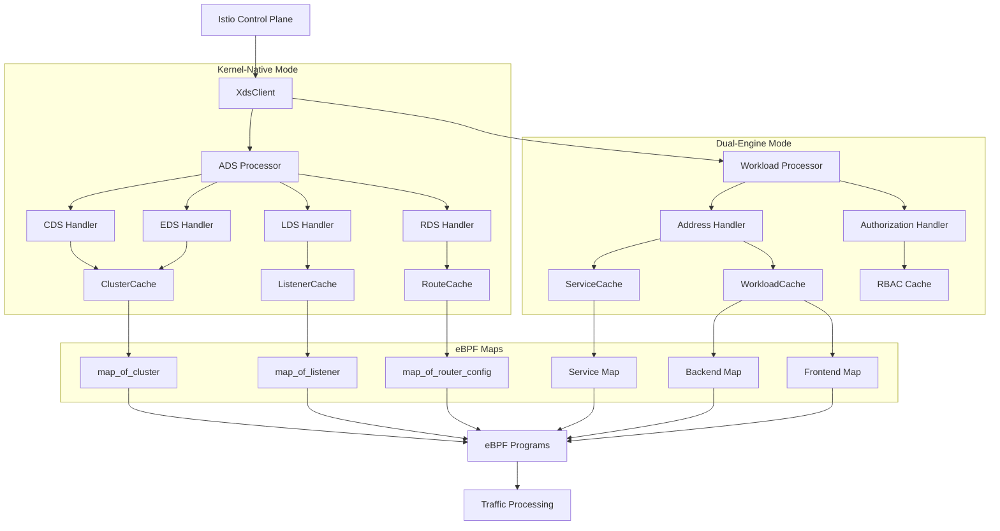

## Kmesh 架构

**两种模式的定位**

- Kernel-Native 模式
    - 数据面完全运行在 eBPF 中：bpf/kmesh/ads/... 里实现 L3-L7 编排，比如 tcp_proxy filter、权重灰度、熔断、限流等。
    - 控制面直接对接 Istio XDS，转换配置写入内核 BPF map。
    - 能力目前最完整，像灰度发布就是在这一套代码路径中实现。
- Dual-Engine 模式
    - 由 eBPF 处理 L4 连接劫持、DNS、Waypoint 引流等“内核擅长的”工作。
    - HTTP/gRPC 等 L7 逻辑则交给 Waypoint Envoy（或其他 sidecarless L7 组件）处理，因此控制面在 pkg/controller/workload/... 中更多关注“把谁导给谁”。
    - 当前仅提供随机、基于拓扑的 L4 负载均衡，灰度这类精细调度需要在 Waypoint/L7 侧完成。

**为什么需要“双轨”**

| 需求场景 | Kernel-Native 模式 | Dual-Engine 模式 |
|----------|-------------------|------------------|
| 纯 L4 治理（灰度、熔断、限流等） | ✔：eBPF 直接完成 | △：需扩展或走 L7 |
| 快速体验/渐进式落地（从无网格到网格） | △：一次性接管 L3-L7，需适配完整能力 | ✔：先启用 L4 安全，再按需挂载 Waypoint |
| L7 协议兼容性、Istio 生态 | 需要 eBPF 端对协议进行解析，特性上线节奏略慢 | Waypoint 复用 Envoy 能力，扩展快 |
| 性能极致（尽量少跳用户态） | ✔：L3-L7 都在内核态完成 | △：L7 需经过 Waypoint |
| 运维复杂度 | 单一组件，逻辑集中 | 需要维护 eBPF + Waypoint 两套组件 |

因此：

- Kernel-Native 更像“全内核数据面”，适合希望 eBPF 一站式提供所有流量治理能力的场景。
- Dual-Engine 则是“内核 + Waypoint”混合体，帮助用户按需、渐进地引入 L7 能力，同时保留 eBPF L4 控制的优势。

### Kmesh daemon

```mermaid
graph TD
    subgraph kmesh-daemon
        direction LR
        D[daemon/main.go] --> M[daemon/manager/manager.go]
        M --> C[pkg/controller/controller.go]
        M --> BPF[bpf.Start]
        M --> CNI[cni.Installer]
        M --> Admin[status.Server]

        subgraph " "
            direction TB
            C --> XDS[xdsclient]
            C --> KMC[kmesh manage controller]
            C --> BC[bypass controller]
            C --> DNS[dns controller]
            C --> IPSec[ipsec controller]
        end
    end

    subgraph kmeshctl
        direction TB
        CLI[ctl/main.go]
        CLI --> log[log]
        CLI --> dump[dump]
        CLI --> waypoint[waypoint]
        CLI --> version[version]
        CLI --> monitoring[monitoring]
        CLI --> authz[authz]
        CLI --> secret[secret]
    end

    kmeshctl -- HTTP/gRPC --> kmesh-daemon

    style KMC fill:#000,stroke:#333,stroke-width:2px
    style XDS fill:#000,stroke:#333,stroke-width:2px
    style BC fill:#000,stroke:#333,stroke-width:2px
    style DNS fill:#000,stroke:#333,stroke-width:2px
    style IPSec fill:#000,stroke:#333,stroke-width:2px
```



1. **启动入口**：`main.go`是程序的入口，它调用`manager.go`中的`NewCommand`来创建一个`cobra.Command`。
2. **执行逻辑**：`manager.go`中的`Execute`函数是核心执行逻辑，它负责：
   - 初始化日志、设置eBPF的memlock rlimit。
   - 启动BPF子系统 (bpf.Start)。
   - 安装和启动CNI插件 (cni.NewInstaller(...).Start())。
   - 启动一个用于状态和调试的Admin Server (status.StartServer)。
   - 启动核心控制器 (controller.Start)。
3. **核心控制器**：controller.go中的Start函数会根据配置（kernel-native或dual-engine模式）启动一系列的子控制器，这些子控制器是数据面资源的主要管理者：
   - XdsClient：与Istiod或其他xDS控制面进行通信，获取服务网格的配置。
   - BypassController：管理Bypass资源，用于绕过网格处理。
   - KmeshManageController：管理Kmesh自身的配置和状态。
   - DNSController：处理DNS相关的逻辑。
   - IPSecController：负责节点间通信的IPsec加密。

#### controllers

详细说明Kmesh中各个controller的功能和作用。

##### XdsClient

从istio获取服务网格的配置信息。有关与xDS协议请参考 [istio.md](./istio.md#envoy).

1. 配置发现与同步
    -  Kernel-Native 模式（ADS方式）：
        - CDS (Cluster Discovery Service): 获取集群（服务）配置信息
        - EDS (Endpoint Discovery Service): 获取服务端点（Pod IP）信息
        - LDS (Listener Discovery Service): 获取监听器配置
        - RDS (Route Discovery Service): 获取路由规则配置
    - Dual-Engine 模式（Delta方式）：
        - Address 资源: 获取 Ambient Mesh 模式下的工作负载和服务信息
        - Authorization 资源: 获取安全策略和授权规则

2. 流量管理配置
从 Istio 获取的这些配置最终会被转换并存储到 eBPF maps 中，用于：
    - 负载均衡: 根据不同的负载均衡算法分发流量
    - 路由规则: 根据请求的目标、头部等信息决定流量转发
    - 服务发现: 维护服务名称到 IP 地址的映射关系
    - 健康检查: 跟踪服务端点的健康状态

3. 安全策略同步
    - 授权策略: 从 Istio 获取访问控制规则
    - TLS 配置: 获取服务间通信的加密配置
    - 认证策略: 同步身份验证相关配置

**kernel-native 模式下的数据流**
```plain
Istio Control Plane → XdsClient (ADS) → AdsProcessor → Cache → eBPF Maps
```

在 kernel-native 模式下，分别会有对应的 `handleCdsResponse`、`handleEdsResponse`、`handleLdsResponse` 和 `handleRdsResponse` 函数来处理从 Istio 获取的不同类型的配置资源。

**dual-engine 模式下的数据流**
```plain
Istio Control Plane → XdsClient (Delta) → WorkloadProcessor → Cache → eBPF Maps
```

具体实现：
- Address 资源：
    - handleAddressTypeResponse() 处理 Address 类型资源
    - Address 是一个 union 类型，包含两种子类型：
        - Address_Workload：工作负载信息（Pod IP、端口、标签等）
        - Address_Service：服务信息（VIP、端口、负载均衡策略等）
- Authorization 资源：
    - handleAuthorizationTypeResponse() 处理授权策略
    - 配置访问控制规则和安全策略



这里两种模式下对数据流的处理是不同的，为什么？
- 在kernel-native模式下，eBPF maps直接存储了Envoy的配置数据结构（Cluster、Listener、Route等）。
- 在dual-engine模式下，eBPF maps存储的是更底层的服务和工作负载信息（Service、Backend、Frontend等）。

在eBPF程序中如何体现这种不同之处呢？

在kernel-native模式下，基于envoy处理链。关于envoy处理链，见[istio.md](./istio.md#envoy-处理链).

**kernel-native 和 dual-engine 模式下的eBPF程序分别位于bpf/kmesh/ads和bpf/kmesh/workload目录下。关于两种模式下的eBPF程序，见后续的BPF部分。**

## workload 
在kmesh中，workload是一个具体的，可寻址的工作负载实例，是数据平面路由的基本单元。
对于kubernetes中的资源其可以是：
1. pod: 最常见的情况
2. deployment 创建的pod
3. statefulset 创建的pod
4. daemonset 创建的pod
5. job/cronjob 创建的pod

非kubernetes资源
1. VM虚拟机
2. 物理机上的服务
3. 外部服务端点
4. Gateway 后面的服务

## service 
**endpoint**: 是 service - workload 之间的映射关系，每一个endpoint都有自己的优先级。endpoint有两个核心的数据结构，EndpointKey 和 EndpointValue。
在 EndpointValue中backenduid是某一个workload的uid。EndpointKey中存储的是serviceid，这样就得到了 serviceid 到 backendid 的映射关系，也就得到了service到workload的映射关系。

``` go
type EndpointKey struct {
    ServiceId    uint32  // 服务ID
    Prio         uint32  // 优先级 (0-6)
    BackendIndex uint32  // 该优先级组内的索引
}

type EndpointValue struct {
    BackendUid uint32    // 对应的 workload ID
}
```

<!-- TODO: 将下面的部分转移到 kmesh daemon下 -->
## go 中四张 map
包含serviceid、没有优先级的Endpoint数量，负载均衡策略，服务端口，目标端口，waypoint地址和端口。
客户端访问一个workload的顺序是：FrontendMap -> ServiceMap -> EndpointMap -> BackendMap。通过backendvalue中的workload ip地址和端口来访问workload。
``` go
// Key: BackendKey
type BackendKey struct {
    BackendUid uint32  // workload ID
}

// Value: BackendValue
type BackendValue struct {
    Ip           [16]byte       // workload IP 地址
    ServiceCount uint32         // 该 workload 属于多少个服务
    Services     [10]uint32     // 该 workload 属于的服务列表
    WaypointAddr [16]byte       // Waypoint 地址
    WaypointPort uint32         // Waypoint 端口
}

// Key: EndpointKey
type EndpointKey struct {
    ServiceId    uint32  // 服务ID
    Prio         uint32  // 优先级 (0-6)
    BackendIndex uint32  // 该优先级组内的索引
}

// Value: EndpointValue  
type EndpointValue struct {
    BackendUid uint32    // 对应的 workload ID
}

// Key: ServiceKey
type ServiceKey struct {
    ServiceId uint32
}

// Value: ServiceValue
type ServiceValue struct {
    EndpointCount [7]uint32      // 每个优先级组的 endpoint 数量
    LbPolicy      uint32         // 负载均衡策略
    ServicePort   [10]uint32     // 服务端口
    TargetPort    [10]uint32     // 目标端口
    WaypointAddr  [16]byte       // Waypoint 地址
    WaypointPort  uint32         // Waypoint 端口
}

// Key: FrontendKey
type FrontendKey struct {
    Ip [16]byte  // IP 地址
}

// Value: FrontendValue
type FrontendValue struct {
    UpstreamId uint32  // 对应的服务ID或workload ID
}
```
handleService -> updateServiceMap -> updateEndpointPriority -> updateEndpointOneByOne 这个函数构建起serviceid到endpoint的映射关系。同时构建EndpointKey和EndpointValue的信息。
在endpointCache中构建起 \[endpoint][workloadUid][endpoint]的映射关系。

``` go
func updateEndpointOneByOne
```

## BPF

Kmesh项目中的BPF程序主要分为两种模式：Kernel-Native模式和Dual-Engine模式。两种模式下的BPF程序分别位于不同的目录中，且实现方式有所不同。

eBPF文件主要位于`bpf/kmesh`目录下，下面对有关文件做一个介绍。

**ads目录**

- `cgroup_sock.c`
    - 作用：在 TCP 连接发起阶段（connect4）进行 Listener 匹配与 FilterChain 选择，驱动 “L4/L7 上的 listener/filterchain/cluster” 路径。核心流程：
        - 根据 ctx->user_ip4/user_port 构造地址，map_lookup_listener 获取 Listener（见 listener.h）
        - 命中后通过 listener_manager() 进入 filter chain 的 tail call
        - 在增强内核下尝试设置 TCP_ULP="kmesh_defer"，延迟接管主要包含两个核心函数：`cgroup_connect4_prog` 和 `cgroup_connect6_prog`，分别用于处理IPv4和IPv6的连接请求。
    - 这些函数会在用户态程序调用`connect`系统调用时被触发，用于在连接建立前对目标地址进行修改，实现服务发现和负载均衡。
    - 通过查找Frontend、Service、Endpoint和Backend四张BPF map，最终将目标地址修改为实际的workload地址。

- `sockops.c`
    - 程序类型：SEC("sockops")
    - 作用：在 TCP 状态回调中配合 ADS 模式做连接建立/关闭时序处理（例如 on_cluster_sock_connect/on_cluster_sock_close），也会设置 BPF_SOCK_OPS_STATE_CB_FLAG 打开更细粒度事件回调。

**头文件（ads/include/）：**

- `listener.h`
    - 定义 map_of_listener（Listener 配置的 eBPF Map），以及 listener_filter_chain_match、listener_manager 等匹配与调度逻辑
    - 使用 tail call 进入 filter chain 程序，实现动态的链式处理
- `filter.h`、`cluster.h`、`tcp_proxy.h`、`local_ratelimit.h`、`circuit_breaker.h`
    - 各类过滤器/集群/代理/限流/熔断的协议与结构定义，供过滤器链路调用
- `kmesh_common.h`、`tail_call.h`、`tail_call_index.h`、`ctx/…`
    - 通用结构、tail-call 工具宏、上下文封装等
- `route_config.h`
    - 路由/匹配相关定义（在 ENHANCED_KERNEL 条件下启用）

**workload/ 子目录**

文件：
- `cgroup_sock.c`
    - 程序类型：SEC("cgroup/connect4")
    - 作用：按“前端(frontend)→服务(service)→端点(endpoint)→后端(backend)”模型进行目的地选择与 DNAT/waypoint 决策
    - 关键步骤：
        - 从 map_of_frontend 找到 frontend 对应的 upstream/service/backend id
        - 结合 map_of_service、map_of_endpoint、map_of_backend 做负载均衡/优先级选择，决定直连还是 waypoint
        - 将原目的地写入 per-socket storage（map_of_sock_storage），供后续阶段（如 sockops/sk_msg）使用
- `sockops.c`
    - 程序类型：SEC("sockops")
    - 作用：在 TCP 连接回调（active/passive established/state）阶段完成：
        - 标记连接是否由 Kmesh 管理（is_managed_by_kmesh）
        - 连接建立时根据是否经 waypoint 决定是否将当前 socket 插入 SockMap（map_of_kmesh_socket），以触发 sk_msg 程序对出站数据进行元数据编码或做直连优化
        - 进行认证观测、状态清理（如关闭时清理 auth map）
- `sendmsg.c`
    - 程序类型：SEC("sk_msg")
    - 作用：在发送路径对 payload 进行 TLV 编码（例如将原始目的地址/端口附带给 waypoint）；当存在 SockMap 匹配时可用于重定向或元数据注入
- `workload/cgroup_skb.c`、`workload/xdp.c`
    - 对部分包路径的补充（如 skb 层处理、XDP 加速/过滤入口），具体逻辑按实现为主（本仓中主要逻辑集中在 sock/消息路径）

**头文件（workload/include/）：**

- `workload.h`
    - 定义核心 eBPF Map：map_of_frontend、map_of_service、map_of_endpoint、map_of_backend，以及认证与策略相关 map（如 map_of_auth_result、map_of_wl_policy）
    - 这些 map 对应 Kmesh 控制面对接 xDS 后的内核态数据结构
- `frontend.h`、`backend.h`、`service.h`、`endpoint.h`
    - 各层抽象的键值与管理函数
- `authz.h`
    - 授权相关（连接建立时校验）
- `workload_common.h`、`tail_call.h`、`xdp.h`、`config.h`
    - 通用结构、tail call 支持、XDP 辅助、编译配置宏
    
要点：workload 目录体现以“服务/端点/工作负载”为中心的寻址与直连路径，结合 SockMap 达到同节点直连与 waypoint 旁路/编解码。

### eBPF 编写

**定义一个BPF map**
在C语言中定义一个BPF map的方式如下：
``` c
struct {
    // 1. 告诉内核：我要创建一个“哈希表”类型的 BPF Map。
    __uint(type, BPF_MAP_TYPE_HASH);

    // 2. 告诉内核：这个 Map 的 Key 是一个 32位无符号整数 (__u32)。
    __uint(key_size, sizeof(__u32));

    // 3. 告诉内核：这个 Map 的 Value 是一个 Istio 授权策略的 C 结构体。
    //    这是非常强大的特性，可以直接将复杂的结构体作为值存入。
    __uint(value_size, sizeof(Istio__Security__Authorization));

    // 4. 告诉内核：这是一个可选的优化标志，表示不要预先分配所有内存。
    __uint(map_flags, BPF_F_NO_PREALLOC);

    // 5. 告诉内核：这个 Map 最多可以存储 MAP_SIZE_OF_AUTH_POLICY 个条目。
    __uint(max_entries, MAP_SIZE_OF_AUTH_POLICY);

// 这个结构体的名字，我们将在 BPF C 代码中用它来指代这个 Map。
} map_of_authz_policy 

// 6. 这是最关键的一步！
SEC(".maps");
```

### BPF map
bpf 程序中维护了多张表，其中四张比较核心的是 frontend、service、endpoint 和 backend map。

**如何通过在用户态的go程序访问和更新内核态的BPF map？**
在go程序中，使用四个对应的cache来记录四张表的内容，这四张表会和内核态的BPF map进行绑定和同步。所以这里涉及到go程序中的四个cache和内核态的BPF map是怎么进行绑定和更新的。
1. 需要使用 cilium/ebpf 库来绑定和操作 BPF map。
2. 操作系统会提供对这四张表的访问接口，会在 /sys/fs/bpf/kmesh/ 提供四张表的文件，并提供用于读写的系统调用。
3. 在go程序中构建与 BPF map 对应的结构体。在  workload_controller 中有Processor 结构体，其中含有下述代码片段：

``` go
type Processor struct {
    // ... other fields
    bpf           *bpf.Cache
    // ... other fields
}
```

并且bpf.Cache 中还有一个关键的结构体 `KmeshCgroupSockWorkloadMaps`

``` go
type Cache struct {
    // ... other fields
    bpfMap bpf2go.KmeshCgroupSockWorkloadMaps
    // ... other fields
}
```
KmeshCgroupSockWorkloadMaps 中通过field labels 来绑定内核态中使用的数据，这个过程应当会用到go中的反射机制，这里应该需要看 cilium/ebpf 的有关代码的实现才能知道具体是怎么操作的：
``` go
type KmeshCgroupSockWorkloadMaps struct {
	KmAuthReq     *ebpf.Map `ebpf:"km_auth_req"`
	KmAuthRes     *ebpf.Map `ebpf:"km_auth_res"`
	KmBackend     *ebpf.Map `ebpf:"km_backend"`
	KmCgrTailcall *ebpf.Map `ebpf:"km_cgr_tailcall"`
	KmEndpoint    *ebpf.Map `ebpf:"km_endpoint"`
	KmFrontend    *ebpf.Map `ebpf:"km_frontend"`
	KmLogEvent    *ebpf.Map `ebpf:"km_log_event"`
	KmManage      *ebpf.Map `ebpf:"km_manage"`
	KmPerfInfo    *ebpf.Map `ebpf:"km_perf_info"`
	KmPerfMap     *ebpf.Map `ebpf:"km_perf_map"`
	KmService     *ebpf.Map `ebpf:"km_service"`
	KmSockstorage *ebpf.Map `ebpf:"km_sockstorage"`
	KmTcpProbe    *ebpf.Map `ebpf:"km_tcp_probe"`
	KmTmpbuf      *ebpf.Map `ebpf:"km_tmpbuf"`
	KmWlpolicy    *ebpf.Map `ebpf:"km_wlpolicy"`
	KmXdpTailcall *ebpf.Map `ebpf:"km_xdp_tailcall"`
	KmeshMap1600  *ebpf.Map `ebpf:"kmesh_map1600"`
	KmeshMap192   *ebpf.Map `ebpf:"kmesh_map192"`
	KmeshMap296   *ebpf.Map `ebpf:"kmesh_map296"`
	KmeshMap64    *ebpf.Map `ebpf:"kmesh_map64"`
}
```

#### KNIMap
KNIMap 是一个 LPM Trie 类型的 BPF map，用于存储 Kmesh 管理的 CIDR 信息。
其中，key是kmesh节点中pod的CIDR地址，value是一个简单的标记值（uint32），表示该 CIDR 由 Kmesh 管理，如果是kmesh管理的value为1。

在tc的bpf程序中会检查这个表，判断是否是kmesh管理的CIDR地址，如果是，则将数据包打上mark，表示需要进行IPSec加密处理。


### BPF 程序
首先是内核传入的bpf_sock_addr结构体，然后根据bpf_sock_addr结构体构造出kmesh_ctx结构体。
核心函数为cgroup_connect4_prog和cgroup_connect6_prog，这两个函数会被内核调用，传入的参数为bpf_sock_addr结构体。
见 *kmesh/bpf/kmesh/workload/cgroup_sock.c*.

**cgroup_connect4_prog 和 cgroup_connect6_prog何时被触发**：
已知的是bpf程序会在进入系统调用之前被触发，那么这两个函数应该是会在调用 connect 系统调用时被触发。因此此时应该还未进入到内核的网络栈中。所以我的理解是bpf程序是工作在内核的网络栈之前的。

#### cgroup_connect4_prog
如果目标的ip地址还没有被kmesh接管，那么就会进行查表。
1. 首先会从kmesh_ctx中获取用户程序想要连接的目标地址，构建出 frontend_key，ip地址为用户程序想要连接的目标地址。
2. 然后会去查找 frontend_map，得到对应的 frontend_value。其中包含了目标的serviceid或者workloadid，即upstream_id。
3. 然后接着查找 service_map，得到对应的 service_value。
4. 接着会查找 endpoint_map，得到对应的 endpoint_key和endpoint_value。
5. 然后会查找 backend_map，得到对应的 backend_key和backend_value。
6. 最后会将目标地址修改为 backend_value 中的 ip 地址和端口。

上述是bpf程序的主要逻辑，还有些其他部分没有搞清楚。如handle_kmesh_manage_process和observe_on_pre_connect等函数的具体功能是什么，目前只知道也会进行查表操作。
在经过bpf程序之后，数据应该会进入内核的网络栈中。

#### 同节点和跨界点时的不同处理

使用Kmesh后，同节点Pod间的服务通信不再需要经过网桥和节点网卡，而是通过eBPF的SockMap技术实现内核级的直接socket转发。


### 负载均衡策略
三种负载均衡策略：**Random**、**Strict**、**Failover**。
这里需要注意的是在 bpf 程序的实现中，随机方法和严格方法在代码上都是使用的最高优先级0中随机的bakend_index。我的理解是之所以都是使用最高优先级0，是因为在 random 使用方便，strict 可能则是因为优先级0代表的是本地性，所以严格方法也使用了优先级0， 而优先级的计算则由用户态的go程序来处理。
**Failover** 在 bpf 程序中则是使用了多优先级递减的方式来处理，也就是先在优先级0中随机选择一个endpoint，如果没有可用的endpoint，则递减到优先级1，依次类推，直到找到一个可用的endpoint。
有关代码实现见 *kmesh/bpf/kmesh/workload/include/service.h*

| 策略 | 优先级使用 | 故障处理 | 特点 |
|------|------------|----------|------|
| **Random** | 只用优先级0 | 无故障转移 | 简单随机 |
| **Strict** | 只用优先级0 | 严格失败 | 严格本地性的简单随机 |
| **Failover** | 多优先级递减 | 自动降级 | 容错性强 |

## CNI

cni网络插件负责维护k8s集群中的路由规则？

## 语言相关
**特殊的函数指针**
``` c
static void *(*bpf_map_lookup_elem)(void *map, const void *key) = (void *) 1;
```
这个函数指针是一个特殊的函数指针，并不是真正的函数实现，而是一个占位符，在编译时会被替换为实际的系统调用。 (void *) 1 对应辅助函数的id。

#### backend map
#### endpoint map 
[见service部分](#service)

四张表是层层映射的关系

## ipsec

关于IPsec的内容，见[linux.md](linux.md#IPsec)。

### Kmesh中的IPsec
#### 设计文档
见 *kmesh/docs/proposal/kmesh_support_encrypt.md*。
在每个容器的出口网卡上添加一个tc(traffic control)程序。将pod中发出的流量打上**mark**标签，标记为走ipsec加密的流量。

#### 数据结构和接口
**KmeshNodeInfo**：KmeshNodeInfo CRD 定义。记录每个node的kmesh信息，包括node的ip地址、bootid、spi版本号等。

**IPsec handler**：管理kmesh中的IPsec密钥和Linux XFRM规则。

**State 和 Policy**：
- `State`：定义了Linux内核XFRM框架中的核心数据结构，用于定义IPSec加密连接的状态信息，描述了如何对网络数据包进行加密/解密处理。
- `Policy`：定义了什么流量需要加密处理，流量匹配条件、处理方向。
``` go
state := &netlink.XfrmState{
    Src:   src,                          // 隧道源IP
    Dst:   dst,                          // 隧道目标IP
    Proto: netlink.XFRM_PROTO_ESP,       // 使用ESP协议
    Mode:  netlink.XFRM_MODE_TUNNEL,     // 隧道模式
    Spi:   ipsecKey.Spi,                 // 安全参数索引
    Reqid: 1,                            // 请求ID (用于关联Policy)
    Aead: &netlink.XfrmStateAlgo{        // 加密算法配置
        Name:   ipsecKey.AeadKeyName,    // 算法名称
        Key:    key,                     // 加密密钥
        ICVLen: ipsecKey.Length,         // 完整性检查长度
    },
}

policy := &netlink.XfrmPolicy{
    Src: srcCIDR,                        // 源网络范围 (如 0.0.0.0/0)
    Dst: dstCIDR,                        // 目标网络范围 (如 Pod CIDR)
    Dir: netlink.XFRM_DIR_IN/OUT/FWD,    // 流量方向
    Tmpls: []netlink.XfrmPolicyTmpl{     // 使用的模板
        {
            Src:   src,                  // 隧道源IP
            Dst:   dst,                  // 隧道目标IP
            Proto: netlink.XFRM_PROTO_ESP,
            Reqid: 1,                    // 关联到对应的State
            Mode:  netlink.XFRM_MODE_TUNNEL,
        },
    },
    Mark: &netlink.XfrmMark{            // 流量标记
        Value: mark,                     // 0xd0 (入站) 或 0xe0 (出站)
        Mask:  0xffffffff,
    },
}
```

ingress mark := uint32(0xd0) 
egress mark := uint32(0xe0)


主要数据结构
``` go
type IpSecKey struct {
    Spi         int    `json:"spi"`        // Security Parameter Index，IPSec 安全参数索引
    AeadKeyName string `json:"aeadKeyName"` // AEAD 算法名称（如 rfc4106）
    AeadKey     []byte `json:"aeadKey"`     // AEAD 加密密钥
    Length      int    `json:"length"`      // 密钥长度
}

type IpSecHandler struct {
    Spi             int                    // 当前使用的 SPI
    mutex           sync.RWMutex           // 读写锁，保证并发安全
    watcher         filewatcher.FileWatcher // 文件监控器
    historyIpSecKey map[int]IpSecKey       // 历史 IPSec 密钥缓存
}
```

核心功能模块：
1. 密钥管理 & 文件监控
- `LoadIPsecKeyFromFile`：从文件加载IPsec密钥。`LoadIPsecKeyFromIO`：从IO读取IPsec密钥。
- `StartWatch`：启动文件监控，监听密钥文件时重新加载。

2. 密钥生成
- `generateIPSecKey`：基于源IP、目标IP、源BootID、目标BootID和原始密钥，使用SHA512生成新的IPSec密钥。

3. XFRM规则管理

入站规则：
- `createXfrmRuleIngress`,创建入站IPSec规则。
- `State规则`：定义ESP协议的加密状态
- `Policy规则`：定义流量策略(IN 和 FWD 方向)

出站规则：
- `createXfrmRuleEgress`：创建出站IPSec规则。
- Policy 规则：定义流量策略(OUT 方向)

**kmesh中如何设置State和Policy规则？**
- `CreateXfrmRule`：创建入站和出站的IPSec规则。
    - `createXfrmRuleIngress`：在其中调用`createStateRule`和`createPolicyRule`来创建入站的IPSec规则。
        - `createStateRule`：根据src和dst网卡地址构建State规则。src为远程node的网卡地址，dst为本地node的网卡地址。
        - `createPolicyRule`：src设置为0.0.0.0，dst设置为本地pod的CIDR地址，tmpl中src设置为远程node的网卡地址，dst设置为本地node的网卡地址。

- `createXfrmRuleEgress`：创建出站的IPSec规则。
    - `createStateRule`：根据src和dst网卡地址构建State规则。src为本地node的网卡地址，dst为远程node的网卡地址。
    - `createPolicyRule`：src设置为0.0.0.0, dst设置为远程pod的CIDR地址，tmpl中src设置为本地node的网卡地址，dst设置为远程node的网卡地址。

- `createStateRule`：根据src和dst网卡地址构建State规则。
- `createPolicyRule`：传入的srcCIDR, dstCIDR, tmpl中的src和dst地址。

**kmesh中如何删除State和Policy规则？**
- `Clean`：传入一个ip地址，获取所有的Policy和state规则，遍历所有的Policy和State规则。对于Policy规则，检查tmpls中的src和dst地址是否与传入和目标地址相等，如果是则删除该Policy规则。对于State规则，检查src和dst地址是否与传入和目标地址相等，如果是则删除该State规则。

- `Flush`：清空所有的Policy和State规则。

**关于spi**
SPI (Security Parameter Index) 的含义
SPI 是 IPSec 协议中的安全参数索引，用于：

唯一标识：在同一对 IP 地址之间可能存在多个 SA（Security Association），SPI 用于区分它们
密钥关联：将数据包与特定的加密密钥和算法关联
协议要求：SPI 是 ESP/AH 头部的必需字段，接收方用它来查找正确的 SA.

但是在kmesh中spi是用来标识key的版本的。对于ingress的规则，都是使用的默认的值0，对于egress的规则，使用的是historyIpSecKey中的spi值。

#### 控制平面逻辑

**IPsec Controller**

``` go
type IPSecController struct {
	informer      cache.SharedIndexInformer
	lister        kmeshnodeinfov1alpha1.KmeshNodeInfoLister
	queue         workqueue.TypedRateLimitingInterface[any]
	knclient      v1alpha1_clientset.KmeshNodeInfoInterface
	kmeshNodeInfo v1alpha1.KmeshNodeInfo
	ipsecHandler  *IpSecHandler
	kniMap        *ebpf.Map
	tcDecryptProg *ebpf.Program
}

```


- NewIPsecController：首先会构建一个k8s的clientset，然后创建一个KmeshNodeInfo的Lister和Informer。接着创建一个IPSecController实例。然后加载IPsec密钥文件。然后通过k8s的clientset获取kmesh节点信息。
有了本地节点信息之后，会将本地节点信息添加到IPSecController的kmeshNodeInfo中，见下面代码。localNodeName是从环境变量中获取的，表示当前节点的名称。然后提取本地节点的NodeInternalIP地址，并将其添加到kmeshNodeInfo的Addresses中。然后注册事件处理器，监听集群节点变化。

  - 初始化ipsec controller
  - 获取本地节点中所有的InternalIP
  - addEventHandler

- 什么是informer和lister？
Informer 是 Kubernetes 中的一个组件，可以监听 Kubernetes API Server 上的资源的变化事件。
Lister 是一个查询工具，可以从 Kubernetes API Server 中获取资源列表，或者从本地缓存中读取资源信息。
一个是监听资源变化，一个是查询资源信息。

- Run：启动Informer，等待缓存同步完成。然后调用attachTcDecrypt函数来附加TC解密程序，在本地节点的网络接口上附加bpf tc解密程序。接着调用syncAllNodeInfo函数来同步所有节点信息。然后更新本地的kmesh节点信息，通知其他节点更新密钥。然后启动IPSec密钥文件的监听。最后开启一个新的goroutine来处理工作队列中的任务。

    - syncAllNodeInfo：在这个函数中，首先获取所有的kmesh节点信息，然后遍历每个节点的信息，调用handleOneNodeInfo函数来处理每个节点的信息。构建IPsec的State和Policy规则。
        - handleOneNodeInfo：处理每一个单独的节点信息。在其中会调用CreateXfrmRule函数来创建入站和出站的IPSec规则。遍历node中每一个pod的ip，调用updateKNIMapCIDR来更新KNIMap中的CIDR信息。

    - attachTcDecrypt：附加TC解密程序到本地节点的网络接口上。这里的网络接口应该是指本地节点的物理网卡。负责在特定的命名空间附加TC解密程序。首先获取本地节点的网络命名空间路径，因为kmesh在容器中运行，需要访问宿主机的网络命名空间。然后使用netns.WithNetNSPath函数来切换到本地节点的网络命名空间，在本地命名空间中执行handleTc函数。

    - handleTc：处理TC解密程序的附加和移除。根据传入的mode参数来决定是附加还是移除TC解密程序。首先获取所有的网络接口，遍历和过滤掉回环接口。然后检查每个接口是否包含本地节点的IP地址，如果包含则继续处理，附加或者分离TC解密程序，通过ManageTCProgram函数来附加或分离TC解密程序。

    - ManageTCProgram：负责具体在网络接口上附加或分离TC解密程序。首先设置队列规则（qdisc），然后创建BpfFilter并附加到ingress钩子点。这里的qdisc是指队列规则，是Linux内核中用于管理网络流量的机制。BpfFilter是指BPF过滤器，用于过滤和处理网络数据包。

  - informer.Run
  - cache.WaitForCacheSync
  - c.attachTcDecrypt
  - c.syncAllNodeInfo
  - c.updateKmeshNodeInfo
  - handler.StartWatch
  - processNextItem：启用一个新的goroutine来处理工作队列中的任务。

- handleOneNodeInfo：好像处理的都是远程节点的信息。主要功能有两个，1. 创建IPSec的State和Policy规则，2. 更新KNIMap中远程节点中pod的CIDR信息。
    - CreateXfrmRule
    - updateKNIMapCIDR：更新KNIMap中的CIDR信息。

- processNextItem

**IPsec Controller的handle函数**
- handleOneNodeInfo：好像处理的都是远程节点的信息。主要功能有两个，1. 创建IPSec的State和Policy规则，2. 更新KNIMap中远程节点中pod的CIDR信息。
    - CreateXfrmRule
    - updateKNIMapCIDR：更新KNIMap中的CIDR信息。

- handleKNIAdd：处理KmeshNodeInfo的添加事件。如果是本地节点，则直接返回。如果是远程节点，则将节点名称添加到工作队列中。

- handleKNIUpdate：处理KmeshNodeInfo的更新事件。传入新旧两个KmeshNodeInfo对象，如果新旧两个对象的Spec相等，则直接返回。如果新旧两个对象的Spec不相等，则将新节点名称添加到工作队列中。

- handleKNIDelete：处理KmeshNodeInfo的删除事件。传入一个KmeshNodeInfo对象，首先调用handler.Clean函数根据目标IP来删除IPSec的State和Policy规则。然后调用deleteKNIMapCIDR函数来删除KNIMap中的CIDR信息。

- processNextItem：处理工作队列中的任务。

## kmeshctl

**Cobra**

Cobra 是一个用于构建命令行应用程序的 Go 库。

### secret

kmesh中的secret是用来创建IPsec密钥的。

## kmesh 与 istio

Kmesh 现在利用 StoW(state-of-the-world) ADS 从 xDS 控制平面订阅 xDS 资源。目前，我们订阅了四种类型的 xDS 资源，包括 CDS、EDS、LDS 和 RDS。
具体实现见 kmesh/docs/xds_handle.md

### xDS

**xds client**

在xDS client中，调用workload controller的 `WorkloadStreamCreateAndSend` （初始化） 函数和 `HandleWorkloadStream` 函数来处理 xDS 资源的订阅和更新。

controller接收到返回的响应后，会将其交由 processer 进行处理。

processer会判断其是哪种资源，一共分为两类。
1. addressTypeResponse，其中包含了 workload 和 service 的有关信息
    - service。 构建service to waypoint 和 waypoint to service。
    - workload。对于四张 eBPF map 的更新，从 backend 开始到 endpoint，再到 service，最后到 frontend。
2. authorizationTypeResponse，其中包含了授权信息。

#### ads controller


## controller

