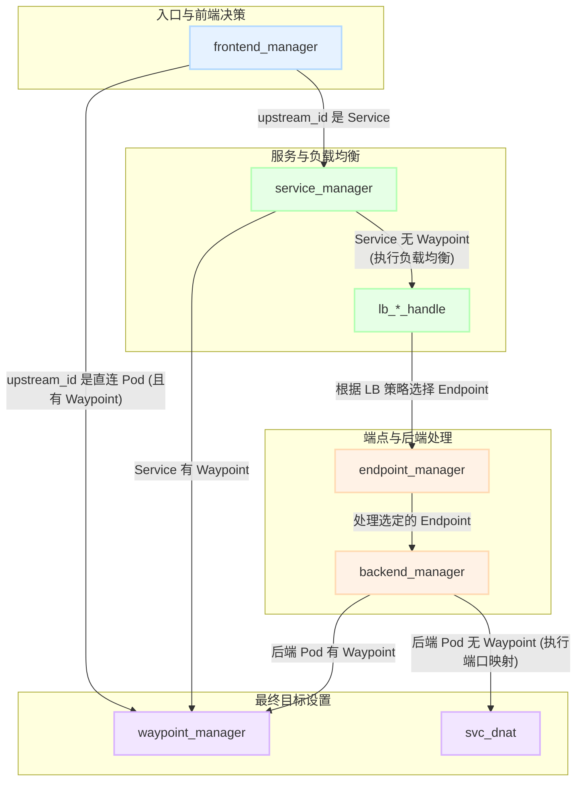

**这个文件主要是对kmesh的源码进行分析和解读。为了避免kmesh.md文件过于冗长和复杂，特将源码分析单独成篇。**

## eBPF

### workload

#### cgroup_sock.c

文件的核心在于**cgroup_connect4**和**cgroup_connect6**两个eBPF程序的入口函数，分别用于处理IPv4和IPv6的连接请求。下面详细解读这两个函数的实现。

```c
SEC("cgroup/connect4") // eBPF 程序挂载点，表示该程序用于处理 IPv4 连接请求
int cgroup_connect4_prog(struct bpf_sock_addr *ctx)
{
    struct kmesh_context kmesh_ctx = {0}; // 声明并清零一个 Kmesh 自定义的上下文对象，用来在各个步骤中传递和保存信息。
    kmesh_ctx.ctx = ctx;
    // 原始目的 IPv4 地址和重定向后的地址，这里先用用户请求的地址进行初始化，后续可能改写
    kmesh_ctx.orig_dst_addr.ip4 = ctx->user_ip4;
    kmesh_ctx.dnat_ip.ip4 = ctx->user_ip4;
    kmesh_ctx.dnat_port = ctx->user_port;

    // 如果不是被kmesh管理的进程，或者kmesh未启用，则直接返回，不做任何处理
    if (handle_kmesh_manage_process(&kmesh_ctx) || !is_kmesh_enabled(ctx)) {
        return CGROUP_SOCK_OK;
    }

    // TODO: should we always try to hijack 53 dns traffic?
    if (ctx->user_port == bpf_htons(53)) { // 如果是 DNS 请求，进行特殊处理
        backend_key backend_k = {0};
        backend_value *backend_v = map_lookup_backend(&backend_k); // 声明一个后端查询 key，清零。通常这是一个“全局”键，用来取 DNS 代理配置。

        // dns proxy is not enabled
        if (!backend_v) { // 如果没有配置 DNS 代理，就不做劫持，直接放行。
            return CGROUP_SOCK_OK;
        }

        kmesh_ctx.dnat_ip.ip4 = backend_v->addr.ip4; // 将 DNAT 目标 IP 设置为 DNS 代理 IP
        if (set_original_dst_info(&kmesh_ctx)) { // 把“原始目的 (IP, 端口)”写入 per-socket storage（只写一次）
            BPF_LOG(ERR, KMESH, "[IPv4]failed to set original destination info");
            return CGROUP_SOCK_OK;
        }

        ctx->user_ip4 = backend_v->addr.ip4;
        return CGROUP_SOCK_OK;
    }

    if (ctx->protocol != IPPROTO_TCP)
        return CGROUP_SOCK_OK;

    observe_on_pre_connect(ctx->sk); // 这里看起来是记录了一下请求连接的时间戳

    int ret = sock_traffic_control(&kmesh_ctx);
    if (ret) {
        return CGROUP_SOCK_OK;
    }
    ret = set_original_dst_info(&kmesh_ctx); // 核心函数
    if (ret) {
        BPF_LOG(ERR, KMESH, "[IPv4]failed to set original destination info, ret is %d\n", ret);
        return CGROUP_SOCK_OK;
    }

    SET_CTX_ADDRESS4(ctx, &kmesh_ctx.dnat_ip, kmesh_ctx.dnat_port);
    if (kmesh_ctx.via_waypoint) {
        kmesh_workload_tail_call(ctx, TAIL_CALL_CONNECT4_INDEX);

        // if tail call failed will run this code
        BPF_LOG(ERR, KMESH, "workload tail call failed, err is %d\n", ret);
    }

    return CGROUP_SOCK_OK;
}
```

```c
static inline int sock_traffic_control(struct kmesh_context *kmesh_ctx)
{
    observe_on_operation_start(SOCK_TRAFFIC_CONTROL, kmesh_ctx); // 观测埋点：标记“流量控制”这个操作的开始，用于性能监控和追踪。
    int ret;
    frontend_value *frontend_v = NULL;
    frontend_key frontend_k = {0};
    struct bpf_sock_addr *ctx = kmesh_ctx->ctx;
    struct ip_addr orig_dst_addr = {0};

    if (ctx->family == AF_INET) {
        orig_dst_addr.ip4 = kmesh_ctx->orig_dst_addr.ip4;
        frontend_k.addr.ip4 = orig_dst_addr.ip4; // 将 Kmesh 上下文中保存的原始目的 IPv4 地址，拷贝
    } else if (ctx->family == AF_INET6) {
        IP6_COPY(orig_dst_addr.ip6, kmesh_ctx->orig_dst_addr.ip6);
        // Java applications use IPv6 for communication. In the IPv4 network environment, the control plane delivers the
        // IPv4 address to the bpf map but obtains the IPv4 mapped address from the bpf prog context. Therefore, address
        // translation is required before and after traffic manager.
        if (is_ipv4_mapped_addr(orig_dst_addr.ip6))
            V4_MAPPED_REVERSE(orig_dst_addr.ip6);
        bpf_memcpy(frontend_k.addr.ip6, orig_dst_addr.ip6, IPV6_ADDR_LEN);
    }

    BPF_LOG(
        DEBUG,
        KMESH,
        "origin dst addr=[%u:%s:%u]\n",
        ctx->family,
        ip2str((__u32 *)&kmesh_ctx->orig_dst_addr, (ctx->family == AF_INET)),
        bpf_ntohs(ctx->user_port));

    frontend_v = map_lookup_frontend(&frontend_k); // 根据原始的目的地址查找service id 或者 backend id(pod)
    if (!frontend_v) {
        return -ENOENT;
    }

    ret = frontend_manager(kmesh_ctx, frontend_v); // 核心函数，接下去会详细解读
    if (ret != 0) {
        if (ret != -ENOENT)
            BPF_LOG(ERR, KMESH, "frontend_manager failed, ret:%d\n", ret);
        return ret;
    }
    observe_on_operation_end(SOCK_TRAFFIC_CONTROL, kmesh_ctx);
    return 0;
}
```

```c
static inline int frontend_manager(struct kmesh_context *kmesh_ctx, frontend_value *frontend_v)
{
    int ret = 0;
    service_key service_k = {0};
    service_value *service_v = NULL;
    backend_key backend_k = {0};
    backend_value *backend_v = NULL;
    bool direct_backend = false;

    service_k.service_id = frontend_v->upstream_id;
    service_v = map_lookup_service(&service_k); // 假设 upstream_id 是一个 service_id，尝试在 service map 中查找对应的服务
    if (!service_v) { // upstream_id 可能不是一个 service_id
        backend_k.backend_uid = frontend_v->upstream_id;
        backend_v = map_lookup_backend(&backend_k); // 尝试在 backend map 中查找对应的后端
        if (!backend_v) {
            BPF_LOG(WARN, FRONTEND, "find backend by backend_uid %d failed\n", backend_k.backend_uid);
            return -ENOENT;
        }
        direct_backend = true; // pod 直连，没有 service
    }

    if (direct_backend) { // in this case, we donot check the healthy status of the backend, just let it go
        // For pod direct access, if a pod has waypoint captured, we will redirect to waypoint, otherwise we do nothing.
        // 这个分支的核心逻辑是判断“直连 Pod”的流量是否需要被其关联的 Waypoint 代理捕获
        if (backend_v->waypoint_port != 0) {
            BPF_LOG(
                DEBUG,
                FRONTEND,
                "find waypoint addr=[%s:%u]\n",
                ip2str((__u32 *)&backend_v->wp_addr, kmesh_ctx->ctx->family == AF_INET),
                bpf_ntohs(backend_v->waypoint_port));
            ret = waypoint_manager(kmesh_ctx, &backend_v->wp_addr, backend_v->waypoint_port); // 核心函数，后续会详细解读
            if (ret != 0) {
                BPF_LOG(ERR, BACKEND, "waypoint_manager failed, ret:%d\n", ret);
            }
            return ret;
        }
    } else {
        // 这个分支处理的是 upstream_id 解析为 Service 的情况
        ret = service_manager(kmesh_ctx, frontend_v->upstream_id, service_v); // 核心函数，后续会详细解读
        if (ret != 0) {
            if (ret != -ENOENT)
                BPF_LOG(ERR, FRONTEND, "service_manager failed, ret:%d\n", ret);
            return ret;
        }
    }

    return 0;
}
```

```c
static inline int service_manager(struct kmesh_context *kmesh_ctx, __u32 service_id, service_value *service_v)
{
    int ret = 0;

    if (service_v->wp_addr.ip4 != 0 && service_v->waypoint_port != 0) { // 判断 service_v 中是否配置了有效的 Waypoint 地址和端口
        BPF_LOG(
            DEBUG,
            SERVICE,
            "find waypoint addr=[%s:%u]\n",
            ip2str((__u32 *)&service_v->wp_addr, kmesh_ctx->ctx->family == AF_INET),
            bpf_ntohs(service_v->waypoint_port));
        ret = waypoint_manager(kmesh_ctx, &service_v->wp_addr, service_v->waypoint_port);
        if (ret != 0) {
            BPF_LOG(ERR, BACKEND, "waypoint_manager failed, ret:%d\n", ret);
        }
        return ret;
    }

    BPF_LOG(DEBUG, SERVICE, "service [%u] lb policy [%u]", service_id, service_v->lb_policy);

    // 执行负载均衡
    switch (service_v->lb_policy) {
    case LB_POLICY_RANDOM: // 随机策略
        ret = lb_random_handle(kmesh_ctx, service_id, service_v); // 在负载均衡函数中，会根据 service_id 查找 endpoint map，得到backend uid，然后再查找 backend map，得到 backend value
        break;
    case LB_POLICY_STRICT: // 严格本地性策略
        ret = lb_locality_strict_handle(kmesh_ctx, service_id, service_v);
        break;
    case LB_POLICY_FAILOVER: // 本地性故障转移策略
        ret = lb_locality_failover_handle(kmesh_ctx, service_id, service_v);
        break;
    default:
        BPF_LOG(ERR, SERVICE, "unsupported load balance type:%u\n", service_v->lb_policy);
        ret = -EINVAL;
        break;
    }

    return ret;
}
```

**三种负载均衡策略**

1. case LB_POLICY_RANDOM:
随机策略。
ret = lb_random_handle(kmesh_ctx, service_id, service_v);
调用 lb_random_handle。该函数会从服务的最高优先级（prio 0）的后端端点列表中，随机选择一个。
case LB_POLICY_STRICT:

2. 严格本地性策略 (Locality Strict)。
ret = lb_locality_strict_handle(kmesh_ctx, service_id, service_v);
调用 lb_locality_strict_handle。该函数会尝试从最高优先级的端点中随机选择一个。关键在于“严格”：如果最高优先级的端点都不可用，它不会尝试其他优先级的端点，而是直接失败。
case LB_POLICY_FAILOVER:

3. 本地性故障转移策略 (Locality Failover)。
ret = lb_locality_failover_handle(kmesh_ctx, service_id, service_v);
调用 lb_locality_failover_handle。该函数会按优先级从高到低遍历端点组。它会在第一个找到的、拥有可用端点的优先级组里，随机选择一个端点。这实现了当高优先级区域（如本地）的端点不可用时，自动将流量切换到次高优先级区域（如其他可用区）的端点。

**接下去是waypoint_manager函数的解读：**

```c
static inline int waypoint_manager(struct kmesh_context *kmesh_ctx, struct ip_addr *wp_addr, __u32 port)
{
    ctx_buff_t *ctx = (ctx_buff_t *)kmesh_ctx->ctx;

    if (ctx->user_family == AF_INET)
        kmesh_ctx->dnat_ip.ip4 = wp_addr->ip4; // 如果是 IPv4，就将 kmesh_ctx 中用于记录 DNAT 目标的 dnat_ip 字段设置为 Waypoint 的 IPv4 地址
    else
        bpf_memcpy(kmesh_ctx->dnat_ip.ip6, wp_addr->ip6, IPV6_ADDR_LEN); // 使用 bpf_memcpy 将 Waypoint 的 IPv6 地址完整地拷贝到 kmesh_ctx 的 dnat_ip 字段中
    kmesh_ctx->dnat_port = port; // 将 kmesh_ctx 中用于记录 DNAT 目标端口的 dnat_port 字段设置为 Waypoint 的端口
    kmesh_ctx->via_waypoint = true;
    return 0;
}
```

##### manager 关系图



#### sendmsg.c

**该文件挂载的eBPF程序是 sendmsg_prog**

这个 eBPF 程序挂载在 sk_msg 钩子上，它会在套接字（socket）发送消息（如 send(), write() 等系统调用）时被触发。它的核心作用是：当流量被重定向到 Waypoint 代理时，在发送的原始数据包前面，额外插入一段元数据（Metadata），告诉 Waypoint 这个连接的“真正”目的地是哪里。

**发给waypoint的数据由于目的地址和端口被修改为waypoint的地址和端口，所以需要通过这种方式告诉waypoint真正的目的地址和端口，否则waypoint无法将数据转发到正确的后端。**

**TLV 编码格式**
文件注释详细说明了元数据的编码格式——TLV (Type-Length-Value)。

- Type (T): 1 字节，表示数据类型。
- Length (L): 4 字节，表示 Value 的长度。
- Value (V): L 字节，实际的数据。

文件中定义了两种 TLV 类型：
1. TLV_ORG_DST_ADDR (0x01): 用于封装“原始目的地址”信息。
2. TLV_PAYLOAD (0xfe): 一个特殊的标记，表示元数据的结束，后面紧跟着的就是原始的应用数据。
一个完整的元数据块结构如下： [TLV for ORG_DST_ADDR] [TLV for PAYLOAD (end marker)] [Original Application Data]

例如，对于一个 IPv4 连接，插入的元数据会是：
| 0x01 | 0x00000006 | 1.2.3.4 | 8080 | 0xfe | 0x00000000 |

```c
SEC("sk_msg")
int sendmsg_prog(struct sk_msg_md *msg)
{
    __u32 off = 0;
    if (msg->family != AF_INET && msg->family != AF_INET6)
        return SK_PASS;

    // encode org dst addr
    encode_metadata_org_dst_addr(msg, &off, (msg->family == AF_INET));
    return SK_PASS;
}
```

核心调用：调用 encode_metadata_org_dst_addr 函数来执行元数据的编码和插入。
msg: 传入 sk_msg 上下文。
&off: 传入偏移量指针，函数内部会更新它。
(msg->family == AF_INET): 传入一个布尔值，告诉函数当前是 IPv4 (true) 还是 IPv6 (false)，以便它能正确处理地址长度。

```c
static inline void encode_metadata_org_dst_addr(struct sk_msg_md *msg, __u32 *off, bool v4)
{
    struct ip_addr dst_ip = {0};
    __u16 dst_port;
    __u8 type = TLV_ORG_DST_ADDR;
    __u32 tlv_size = (v4 ? TLV_ORG_DST_ADDR4_SIZE : TLV_ORG_DST_ADDR6_SIZE);
    __u32 addr_size = (v4 ? TLV_ORG_DST_ADDR4_LENGTH : TLV_ORG_DST_ADDR6_LENGTH);

    if (get_origin_dst(msg, &dst_ip, &dst_port))
        return;

    if (alloc_dst_length(msg, tlv_size + TLV_END_SIZE))
        return;

    BPF_LOG(DEBUG, SENDMSG, "get valid dst, do encoding...\n");

    // write T
    SK_MSG_WRITE_BUF(msg, off, &type, TLV_TYPE_SIZE);

    // write L
    addr_size = bpf_htonl(addr_size);
    SK_MSG_WRITE_BUF(msg, off, &addr_size, TLV_LENGTH_SIZE);

    // write V
    if (v4)
        SK_MSG_WRITE_BUF(msg, off, (__u8 *)&dst_ip.ip4, TLV_IP4_LENGTH);
    else
        SK_MSG_WRITE_BUF(msg, off, (__u8 *)dst_ip.ip6, TLV_IP6_LENGTH);
    SK_MSG_WRITE_BUF(msg, off, &dst_port, TLV_PORT_LENGTH);

    // write END
    encode_metadata_end(msg, off);
    return;
}
```

1. `get_origin_dst(msg, &dst_ip, &dst_port)`
这是决策点。它会去查询当前 socket 的 sock_storage。
如果 !storage (没有存储), !storage->via_waypoint (不是去往 Waypoint 的连接), 或者 storage->has_encoded (已经编码过了)，则直接返回 -ENOENT。
只有当连接是明确发往 Waypoint 且尚未编码过元数据时，它才会成功返回 0，并填充 dst_ip 和 dst_port。
成功后，它会设置 storage->has_encoded = true;，防止对同一个 socket 的后续消息重复编码。
如果此函数失败，encode_metadata_org_dst_addr 会直接 return，不执行任何操作。

2. `alloc_dst_length(msg, ...)`
如果 get_origin_dst 成功，就调用此函数。
它使用 bpf_msg_push_data(msg, 0, length, 0) 这个 BPF aPI，在消息数据的最前面（偏移量为 0）“推入”一段空间，用于存放我们的 TLV 元数据。
如果分配空间失败，函数会返回，编码中止。

3. 构造 TLV
使用 SK_MSG_WRITE_BUF 宏，按顺序将 Type、Length、Value (IP 和 Port) 写入刚刚分配的空间。
bpf_htonl(addr_size): 注意 Length 字段在写入时被转换成了网络字节序。

4. `encode_metadata_end(msg, &off)`
最后，调用此函数写入元数据结束标记（Type=0xfe, Length=0）。

```c
static inline int get_origin_dst(struct sk_msg_md *msg, struct ip_addr *dst_ip, __u16 *dst_port)
{
    struct bpf_sock *sk = (struct bpf_sock *)msg->sk;

    struct sock_storage_data *storage = NULL;
    storage = bpf_sk_storage_get(&map_of_sock_storage, sk, 0, 0);
    if (!storage || !storage->via_waypoint || storage->has_encoded) {
        return -ENOENT;
    }

    if (msg->family == AF_INET) {
        dst_ip->ip4 = storage->sk_tuple.ipv4.daddr;
        *dst_port = storage->sk_tuple.ipv4.dport;
    } else {
        bpf_memcpy(dst_ip->ip6, storage->sk_tuple.ipv6.daddr, IPV6_ADDR_LEN);
        *dst_port = storage->sk_tuple.ipv6.dport;
    }

    storage->has_encoded = true;

    return 0;
}

static inline int alloc_dst_length(struct sk_msg_md *msg, __u32 length)
{
    int ret;
    ret = bpf_msg_push_data(msg, 0, length, 0);
    if (ret) {
        BPF_LOG(ERR, SENDMSG, "failed to alloc memory for msg, length is %d\n", length);
        return 1;
    }
    return 0;
}
```

#### sockops.c

**该文件挂载的eBPF程序是 sockops_prog, 该程序挂载在 sock_ops 上。**

```c
SEC("sockops")
int sockops_prog(struct bpf_sock_ops *skops)
{
    if (skops->family != AF_INET && skops->family != AF_INET6)
        return 0;

    switch (skops->op) {
    case BPF_SOCK_OPS_TCP_CONNECT_CB:
        skops_handle_kmesh_managed_process(skops);
        break;
    case BPF_SOCK_OPS_ACTIVE_ESTABLISHED_CB:
        if (!is_managed_by_kmesh(skops))
            break;
        observe_on_connect_established(skops->sk, OUTBOUND);
        if (bpf_sock_ops_cb_flags_set(skops, BPF_SOCK_OPS_STATE_CB_FLAG) != 0)
            BPF_LOG(ERR, SOCKOPS, "set sockops cb failed!\n");
        struct bpf_sock *sk = (struct bpf_sock *)skops->sk;
        if (!sk) {
            break;
        }
        struct sock_storage_data *storage = NULL;
        storage = bpf_sk_storage_get(&map_of_sock_storage, sk, 0, 0);
        if (!storage) {
            break;
        }

        if (storage->via_waypoint) {
            enable_encoding_metadata(skops);
        }
        break;
    case BPF_SOCK_OPS_PASSIVE_ESTABLISHED_CB:
        if (!is_managed_by_kmesh(skops) || skip_specific_probe(skops))
            break;
        observe_on_connect_established(skops->sk, INBOUND);
        if (bpf_sock_ops_cb_flags_set(skops, BPF_SOCK_OPS_STATE_CB_FLAG) != 0)
            BPF_LOG(ERR, SOCKOPS, "set sockops cb failed!\n");
        auth_ip_tuple(skops);
        break;
    case BPF_SOCK_OPS_STATE_CB:
        if (skops->args[1] == BPF_TCP_CLOSE) {
            observe_on_close(skops->sk);
            clean_auth_map(skops);
        }
        break;
    default:
        break;
    }
    return 0;
}
```